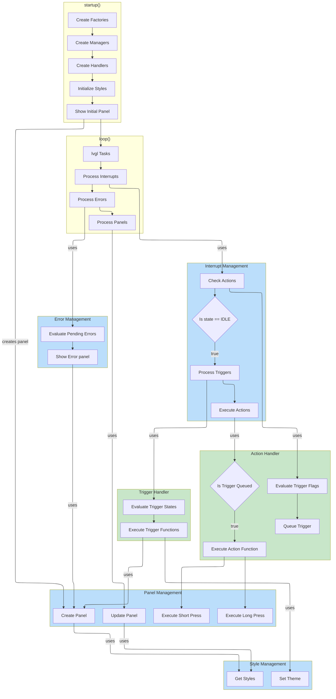

# Application Flow Diagram

This diagram illustrates the complete application flow from startup through runtime operations.

## Flow Overview

- **Startup Sequence**: Multi-factory initialization with core dependency pattern (ProviderFactory → ManagerFactory), handler creation with sensor ownership, and initial panel display
- **Main Loop Integration**: LVGL tasks, interrupt processing, error handling, and panel management work together
- **Handler Ownership**: TriggerHandler creates/owns GPIO sensors, ActionHandler creates/owns button sensor during initialization
- **Trigger/Action Model**: State-based Triggers with dual functions, event-based Actions with single execution
- **Panel Management**: Self-sufficient panels create own components, Key/Lock panels are display-only (no sensors)
- **Evaluation Model**: Actions evaluated every main loop iteration for responsiveness, Triggers evaluated only during idle
- **Execution Model**: Both handlers execute only during UI idle state, Triggers processed before Actions
- **Dual-Function Triggers**: Each Trigger has activate/deactivate functions for state transitions
- **Button Actions**: Short press (50ms-2000ms) and long press (2000ms-5000ms) events through ActionHandler
- **Priority Override**: Triggers use CRITICAL > IMPORTANT > NORMAL priorities with blocking logic
- **Smart Restoration**: Automatic return to last user-driven panel when triggers deactivate
- **Theme Switching**: Non-blocking theme changes through LightsSensor trigger

For detailed architecture, see: **[Architecture Document](../architecture.md)**

## Key Flow Details

### Startup Sequence
1. **Core Factory Dependency Pattern Implementation**: 
   - ProviderFactory created first (implements IProviderFactory for hardware abstraction)
   - ProviderFactory creates hardware providers (Device, GPIO, Display)
   - ManagerFactory created with ProviderFactory dependency injection (Provider → Manager pattern)
2. **Service Initialization Order**: 
   - ManagerFactory uses injected ProviderFactory to obtain providers
   - Creates PreferenceManager (for user settings)
   - Creates StyleManager (with theme from preferences)  
   - Creates InterruptManager (with GPIO provider)
   - Creates PanelManager (with all dependencies)
   - Creates ErrorManager (singleton pattern)
3. **Handler Creation with Sensor Ownership**:
   - InterruptManager creates TriggerHandler → owns GPIO sensors (Key, Lock, Lights)
   - InterruptManager creates ActionHandler → owns ButtonSensor
   - Handlers register their Triggers and Actions with InterruptManager
4. **Initialize Styles**: Setup visual styles and themes for the UI
5. **Show Initial Panel**: 
   - PanelManager creates initial panel
   - Panel creates own components internally (self-sufficient design)
   - Key/Lock panels are display-only (no sensor creation)
6. **Enter Main Loop**: Begin LVGL tasks and runtime processing

### Runtime Processing
**Main Loop Flow (loop())**:

1. **LVGL Tasks**: Process LVGL rendering and animation tasks
2. **Process Interrupts**: Handle interrupt evaluation and execution
   - **Evaluate Actions**: Continuously check button events for responsiveness
   - **Check UI Idle State**: Determine if UI is idle for further processing
   - **If IDLE**: Process interrupts (Triggers before Actions)
     - Evaluate and execute Triggers with priority override logic
     - Then execute Actions (button short/long press events)
     - Processing order ensures state changes have priority over events
3. **Process Errors**: Evaluate error conditions and show error panel if needed
4. **Process Panels**: Update current panel display and handle transitions

**Interrupt Processing Flow**:
- **Handler Ownership Model**:
  - TriggerHandler owns all GPIO sensors (created during handler initialization)
  - ActionHandler owns ButtonSensor (created during handler initialization)
- **Action Handler (Events)**: 
  - Evaluates button events every main loop iteration for responsiveness
  - Detects short (50ms-2000ms) and long (2000ms-5000ms) press durations
  - Executes button actions only when UI is idle
- **Trigger Handler (States)**:
  - Evaluates GPIO state changes only when idle
  - Executes dual functions: activate on HIGH, deactivate on LOW
  - Implements priority-based override logic (CRITICAL > IMPORTANT > NORMAL)
- **Processing Priority**: Triggers execute before Actions when both pending

**Key Architecture Benefits**:
- **Trigger/Action Separation**: Clear distinction between state-based and event-based interrupts
- **Continuous Responsiveness**: Actions always evaluated for button event detection
- **Idle-Only Execution**: Both handlers execute only during idle for UI performance
- **Priority Override System**: Sophisticated blocking logic for critical triggers
- **Smart Restoration**: Automatic return to last user-driven panel

### Interrupt Processing Steps
1. **Evaluate Actions**: Always check for button events (every loop)
2. **Check Idle State**: Determine if UI is idle before processing
3. **If Idle - Process Triggers First**: 
   - Evaluate GPIO state changes via TriggerHandler sensors
   - Execute activate/deactivate functions based on state
   - Apply priority-based override logic
4. **If Idle - Then Execute Actions**: 
   - Execute pending button actions (short/long press)
   - Triggers have already been processed (priority order)
5. **Smart Restoration**: PanelManager tracks and restores last user panel when appropriate

### Panel and Style Integration
- **Panel Self-Sufficiency**: 
  - Panels create their own components internally during initialization
  - Data panels (Oil) create own data sensors
  - Display-only panels (Key/Lock) create no sensors
- **Panel Creation**: PanelManager creates and loads panels via Trigger activation functions
- **Style Retrieval**: Panels get styles from StyleManager during creation and updates
- **Theme Changes**: LightsSensor trigger handles theme switching (NIGHT on activate, DAY on deactivate)
- **Button Actions**: Short and long press events execute through ActionHandler
- **Panel Restoration**: Smart restoration to last user-driven panel when triggers deactivate

### Error System
- **Error Evaluation**: Separate error evaluation in main loop
- **Error Trigger**: Error sensor activates error trigger with CRITICAL priority
- **Error Panel Display**: Error trigger activation function loads error panel
- **Error Recovery**: Deactivation function handles restoration to previous panel

### Key System Components
- **Multi-Factory Architecture**: 
  - **Core Dependency Pattern**: ProviderFactory → ManagerFactory chain
    - ProviderFactory implements IProviderFactory for hardware abstraction
    - Creates DeviceProvider, GpioProvider, DisplayProvider
    - ManagerFactory accepts IProviderFactory for dependency injection
    - Uses injected factory to obtain providers for manager creation
  - **UI Singleton Factories**: PanelFactory and ComponentFactory operate independently
    - PanelFactory creates panels on demand from managers
    - ComponentFactory creates UI components from panels
  - **Complete Testability**: Mock provider factory injection enables full testing
- **Handlers with Ownership**: 
  - TriggerHandler owns GPIO sensors (created during initialization)
  - ActionHandler owns ButtonSensor (created during initialization)
- **Trigger/Action Architecture**:
  - Triggers: State-based with dual activate/deactivate functions
  - Actions: Event-based with single execution function
  - Priority system: CRITICAL > IMPORTANT > NORMAL (Triggers only)
- **Panel Management**: Centralized panel creation, loading, and smart restoration
- **Self-Sufficient Panels**: Create own components, Key/Lock are display-only
- **Style Management**: Theme setting via LightsSensor trigger

### Performance Features
- **Processing Order**: Triggers execute before Actions when both pending
- **Idle-Based Execution**: Both handlers execute only during UI idle
- **Continuous Evaluation**: Actions always evaluated for button responsiveness
- **Priority Override**: Sophisticated blocking logic prevents unnecessary panel switches
- **Efficient Flow**: Main loop integrates LVGL, interrupts, errors, and panels
- **Clean Architecture**: Clear Trigger/Action separation with appropriate complexity
- **Memory Optimized**: Direct singleton calls eliminate context pointers for ESP32 efficiency

For complete architecture details, see: **[Architecture Document](../architecture.md)**