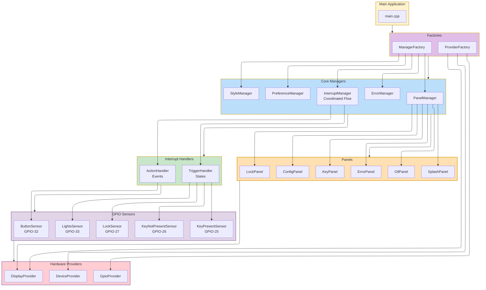

# Architecture Overview Diagram  

**Related Documentation:**
- **[Main Architecture](../architecture.md)** - Complete architectural documentation
- **[Application Flow](application-flow.md)** - Runtime processing flows
- **[Interrupt Flow](interrupt-handling-flow.md)** - Detailed interrupt processing

This diagram shows the high-level component relationships in the Clarity system with the TriggerHandler/ActionHandler interrupt architecture.

## Key Architectural Elements

- **Trigger/Action Separation**: State-based Triggers (GPIO) vs event-based Actions (buttons)
- **Dual-Function Triggers**: Each Trigger has activate/deactivate functions for state transitions
- **Priority-Based Override**: Triggers have priority levels (CRITICAL > IMPORTANT > NORMAL) with blocking logic
- **Button Timing Logic**: Actions handle short press (50ms-2000ms) and long press (2000ms-5000ms)
- **Evaluation/Execution Split**: Actions evaluate always, execute when idle; Triggers evaluate/execute only when idle
- **Multi-Factory Architecture**: ProviderFactory creates hardware providers, ManagerFactory creates managers (with provider dependency), plus singleton PanelFactory and ComponentFactory for UI
- **Interface-Based Factories**: IProviderFactory enables testability with mock provider injection
- **Handler-Owned Sensors**: TriggerHandler owns GPIO sensors, ActionHandler owns button sensor
- **Panel Self-Sufficiency**: Panels create their own components and data sensors internally
- **Split Sensor Design**: Independent KeyPresentSensor and KeyNotPresentSensor classes
- **Smart Restoration**: Automatic return to last user-driven panel when triggers deactivate
- **Display-Only GPIO Panels**: Key/Lock panels don't create sensors, only display state
- **Hardware Abstraction**: Providers isolate hardware dependencies

## Component Responsibilities

### Factories
- **ProviderFactory**: Implements IProviderFactory interface, creates all hardware providers (GpioProvider, DisplayProvider, DeviceProvider)
- **ManagerFactory**: Creates all managers, receives IProviderFactory for dependency injection

### Managers
- **InterruptManager**: Coordinates TriggerHandler and ActionHandler, implements v4.0 Trigger/Action architecture with priority-based override logic and smart restoration
- **PanelManager**: Creates panels on demand, manages lifecycle, switching, tracks last user-driven panel for restoration
- **StyleManager**: Theme management (Day/Night) based on LightsSensor trigger
- **PreferenceManager**: Persistent settings storage
- **ErrorManager**: Error collection with trigger system integration

### Coordinated Handlers (IHandler Interface)
- **TriggerHandler**: Creates and owns GPIO sensors for state monitoring, processes Triggers with dual activate/deactivate functions, implements priority-based override logic, evaluates and executes only during UI IDLE
- **ActionHandler**: Creates and owns button sensor, detects short (50ms-2000ms) and long (2000ms-5000ms) press events, evaluates always but executes only during UI IDLE
- **Processing Model**: Actions evaluated every main loop iteration for responsiveness, both handlers execute only during idle for UI performance

### Sensors (ISensor + BaseSensor)
- **GPIO State Sensors**: Created and owned by TriggerHandler for GPIO state monitoring (Key, Lock, Lights sensors)
- **Button Event Sensor**: Created and owned by ActionHandler, provides button press duration measurement
- **Data Sensors**: Created by data panels for continuous measurement (Oil pressure, temperature)
- **BaseSensor**: Provides DetectChange template for all sensors with atomic comparison and state update

### Panels (IPanel Interface)
- **Display-Only Panels**: Display-only, create own components but no sensors (Key, Lock)
- **Data Panels**: Create own sensors and components for data acquisition (Oil)
- **Utility Panels**: Create own components for system functions (Splash, Error, Config)

### Architecture Constraints
- **Trigger/Action Model**: State-based Triggers (GPIO) with dual functions vs event-based Actions (buttons) with single execution
- **Priority Override System**: CRITICAL > IMPORTANT > NORMAL priorities with blocking logic for Triggers only
- **Button Timing Integration**: ActionHandler detects press duration (50ms-2000ms short, 2000ms-5000ms long)
- **Processing Separation**: Actions evaluate always for responsiveness, both handlers execute only during UI idle
- **Interface-Based Design**: All major components implement interfaces for testability and loose coupling
- **Multi-Factory Architecture**: Core dependency pattern (ProviderFactory → ManagerFactory) plus UI singleton factories (PanelFactory, ComponentFactory)
- **Dependency Injection**: IProviderFactory interface enables test mocking and clean separation
- **Smart Restoration**: PanelManager tracks last user-driven panel, restores when triggers deactivate
- **No Context Parameters**: Direct singleton manager calls eliminate need for context pointers
- **Specialized Ownership**: TriggerHandler owns GPIO sensors, ActionHandler owns button sensor
- **Memory Safety**: Designed for ESP32 memory constraints with optimized data structures
- **State Change Detection**: Triggers fire on GPIO state transitions, Actions fire on button events