# Interrupt Handling Flow Diagram

This diagram illustrates detailed interrupt processing flow concepts.

## Flow Overview

- **Dual Processing Model**: Separate evaluation and execution phases for Triggers vs Actions
- **Continuous Action Evaluation**: ActionHandler evaluates every main loop iteration for responsiveness
- **Idle-Only Trigger Processing**: TriggerHandler evaluates and executes only during UI IDLE state
- **Priority and Type System**: Triggers use Priority (Critical/Important/Normal) and Type (Panel/Style/Function) for intelligent execution
- **Queue-Based Actions**: Actions queue events immediately, execute during idle in registration order
- **State Change Detection**: Triggers fire only on GPIO state transitions using BaseSensor change detection
- **Memory Optimized**: Direct singleton calls eliminate context parameters for efficiency
- **Handler Ownership**: TriggerHandler owns GPIO sensors, ActionHandler owns ButtonSensor

For complete architecture details, see: **[Architecture Document](../architecture.md)**

```mermaid
---
config:
  layout: elk
  theme: default
  elk: {}
---
flowchart TD
 subgraph InterruptProcessing["Interrupt Processing"]
        ActionEval["Action Evaluation<br>ALWAYS"]
        IdleCheck{"UI State<br>== IDLE?"}
        TriggerProc["Trigger Processing<br>"]
        ActionExec["Action Execution<br>IDLE ONLY"]
  end
 subgraph ActionHandling["Action Handler Flow"]
        ButtonSensor["ButtonSensor<br>Check State"]
        ActionChanged{"State<br>Changed?"}
        TimingCheck["Check Press Duration"]
        ShortPress{"50ms-2000ms<br>SHORT?"}
        LongPress{"2000ms-5000ms<br>LONG?"}
        QueueShort["Queue Short Action<br>hasTriggered = true"]
        QueueLong["Queue Long Action<br>hasTriggered = true"]
  end
 subgraph ActionExecution["Action Execution (Idle Only)"]
        ActionPending{"Actions<br>Queued?"}
        ExecuteAction["Execute Action Function<br>Clear hasTriggered"]
        ActionComplete["Action Complete"]
  end
 subgraph TriggerHandling["Trigger Handler Flow"]
        TriggerLoop["For Each Trigger"]
        SensorCheck["Check Sensor<br>HasStateChanged"]
        TriggerChanged{"State<br>Changed?"}
        StateDirection{"HIGH or<br>LOW?"}
        ActivateFlow["Activation Flow"]
        DeactivateFlow["Deactivation Flow"]
  end
 subgraph ActivationFlow["Trigger Activation Flow"]
        ErrorPanelCheck{"ErrorPanel<br>Active?"}
        ErrorTriggerCheck{"Is Error<br>Trigger?"}
        BlockTrigger["Block Trigger<br>Execution<br>(Keep State)"]
        PriorityCheck{"Higher Priority<br>Active Trigger?"}
        ExecuteActivate["Execute Trigger<br>activateFunc<br>isActive = true"]
        SetActiveOnly["Set isActive = true<br>No Function Execution"]
  end
 subgraph DeactivationFlow["Trigger Deactivation Flow"]
        ExecuteDeactivate["Execute Trigger<br>deactivateFunc<br>isActive = false"]
        SameTypeCheck["Find Same Type<br>Active Triggers"]
        SameTypeFound{"Same Type<br>Found?"}
        ReActivateSameType["Execute Highest Priority<br>Same Type activateFunc"]
  end
 subgraph StateDetection["State Change Detection"]
        BaseSensor["BaseSensor<br>DetectChange Template"]
        PrevState["Previous State<br>Tracking"]
        CurrentState["Current GPIO<br>Reading"]
        StateComparison["Compare Current<br>vs Previous"]
        UpdatePrevious["Update Previous<br>State"]
  end
    InterruptMgr["InterruptManager Process"] --> ActionEval
    ActionEval --> IdleCheck & ButtonSensor
    IdleCheck -- Yes --> TriggerProc
    TriggerProc --> ActionExec & TriggerLoop
    ButtonSensor --> ActionChanged
    ActionChanged -- Yes --> TimingCheck
    ActionChanged -- No --> IdleCheck
    TimingCheck --> ShortPress
    ShortPress -- Yes --> QueueShort
    ShortPress -- No --> LongPress
    LongPress -- Yes --> QueueLong
    QueueShort --> IdleCheck
    QueueLong --> IdleCheck
    ActionExec --> ActionPending
    ActionPending -- Yes --> ExecuteAction
    ExecuteAction --> ActionComplete
    TriggerLoop --> SensorCheck
    SensorCheck --> TriggerChanged & BaseSensor
    TriggerChanged -- Yes --> StateDirection
    StateDirection -- HIGH --> ActivateFlow
    StateDirection -- LOW --> DeactivateFlow
    ActivateFlow --> ErrorPanelCheck
    ErrorPanelCheck -- Yes --> ErrorTriggerCheck
    ErrorPanelCheck -- No --> PriorityCheck
    ErrorTriggerCheck -- No --> BlockTrigger
    ErrorTriggerCheck -- Yes --> PriorityCheck
    PriorityCheck -- No --> ExecuteActivate
    PriorityCheck -- Yes --> SetActiveOnly
    DeactivateFlow --> ExecuteDeactivate
    ExecuteDeactivate --> SameTypeCheck
    SameTypeCheck --> SameTypeFound
    SameTypeFound -- Yes --> ReActivateSameType
    BaseSensor --> PrevState & CurrentState
    CurrentState --> StateComparison
    PrevState --> StateComparison
    StateComparison --> UpdatePrevious
    UpdatePrevious --> TriggerChanged
     InterruptMgr:::interrupt
     ActionEval:::interrupt
     IdleCheck:::decision
     ButtonSensor:::action
     ActionChanged:::decision
     TimingCheck:::action
     ShortPress:::decision
     LongPress:::decision
     QueueShort:::action
     QueueLong:::action
     ActionPending:::decision
     ExecuteAction:::action
     ActionComplete:::process
     TriggerLoop:::trigger
     SensorCheck:::trigger
     TriggerChanged:::decision
     StateDirection:::decision
     ActivateFlow:::trigger
     DeactivateFlow:::trigger
     PriorityCheck:::decision
     ErrorPanelCheck:::decision
     ErrorTriggerCheck:::decision
     BlockTrigger:::trigger
     ExecuteActivate:::trigger
     SetActiveOnly:::trigger
     ExecuteDeactivate:::trigger
     SameTypeCheck:::trigger
     SameTypeFound:::decision
     ReActivateSameType:::trigger
     BaseSensor:::sensor
     PrevState:::sensor
     CurrentState:::sensor
     StateComparison:::sensor
     UpdatePrevious:::sensor
    classDef interrupt fill:#fff2cc,stroke:#d6b656,stroke-width:2px
    classDef action fill:#e1d5e7,stroke:#9673a6,stroke-width:2px
    classDef trigger fill:#f8cecc,stroke:#b85450,stroke-width:2px
    classDef decision fill:#fff2cc,stroke:#d6b656,stroke-width:3px
    classDef process fill:#dae8fc,stroke:#6c8ebf,stroke-width:2px
    classDef sensor fill:#ffe6cc,stroke:#d79b00,stroke-width:2px
    style InterruptProcessing fill:#FFF8DC
    style ActionHandling fill:#F0E6FF
    style ActionExecution fill:#F0E6FF
    style TriggerHandling fill:#FFE6E6
    style ActivationFlow fill:#FFE6E6
    style DeactivationFlow fill:#FFE6E6
    style StateDetection fill:#FFF0E6
```



## Key Flow Details

### Main Loop Integration

**Continuous Processing Model**:
- **InterruptManager Process**: Starting point that coordinates interrupt evaluation and execution

### Interrupt Processing Coordination

**InterruptManager Orchestration**:
- **Action Evaluation**: Always performed every main loop iteration for responsiveness
- **Idle State Check**: Determines if UI is idle for further processing
- **Trigger Processing**: Only performed during UI IDLE state
- **Action Execution**: Only performed during UI IDLE state after Triggers
- **Execution Order**: When UI is idle, Triggers execute before Actions (evaluation vs execution phases)

### Action Handler Flow (Event-Based)

**Continuous Evaluation Model**:
1. **Sensor Check**: ButtonSensor checks GPIO state every iteration
2. **Change Detection**: Uses BaseSensor change detection template
3. **Timing Analysis**: Measure press duration for event classification
4. **Event Queuing**: Set `hasTriggered = true` for valid events
5. **Idle Execution**: Process all queued Actions during UI idle

**Press Duration Classification**:
- **Short Press**: 50ms - 2000ms duration
- **Long Press**: 2000ms - 5000ms duration  
- **Invalid Press**: Outside duration ranges (ignored)

**Queue Management**:
- **Registration Order**: Actions execute in registration order (no priority)
- **Event Flags**: Each Action maintains `hasTriggered` boolean in Action struct
- **Queue Setting**: `action.hasTriggered = true` in ActionHandler evaluation
- **Queue Execution**: ExecutePendingActions() processes all hasTriggered actions
- **Queue Clearing**: Action.Execute() sets `hasTriggered = false` after execution

**Action Processing Flow**:
```cpp
// 1. Event Detection & Queuing - Current implementation
void ActionHandler::EvaluateIndividualAction(Action& action) {
    // Button state changes detected via ButtonSensor
    if (buttonSensor_->HasStateChanged()) {
        uint32_t pressDuration = buttonSensor_->GetPressDuration();
        
        // Check if this action matches the detected press type
        if ((pressDuration >= 50 && pressDuration < 2000 && action.pressType == ActionPress::SHORT) ||
            (pressDuration >= 2000 && pressDuration <= 5000 && action.pressType == ActionPress::LONG)) {
            action.hasTriggered = true;  // Queue the action
            log_d("Action '%s' triggered with %lums press", action.id, pressDuration);
        }
    }
}

// 2. Queue Processing
void ActionHandler::ExecutePendingActions() {
    for (size_t i = 0; i < actionCount_; i++) {
        Action& action = actions_[i];
        if (action.hasTriggered) {
            action.Execute();  // Clears hasTriggered automatically
        }
    }
}

// 3. Execution with Auto-Clear
void Action::Execute() {
    if (executeFunc && hasTriggered) {
        executeFunc();
        hasTriggered = false;  // Clear trigger flag after execution
    }
}
```

### Trigger Handler Flow (State-Based)

**Idle-Only Processing Model**:
1. **Idle Check**: TriggerHandler only processes during UI IDLE state
2. **Sensor Iteration**: Check each registered Trigger's sensor
3. **State Change Detection**: Use BaseSensor template for change detection
4. **Direction Analysis**: Determine HIGH (activate) vs LOW (deactivate) transition
5. **Function Execution**: Execute appropriate activate/deactivate function

**Activation Flow with Priority Logic**:
1. **ErrorPanel Blocking Check**: Check if ErrorPanel is currently active
2. **Error Trigger Exception**: If ErrorPanel is active:
   - **Non-Error Triggers**: Block execution but maintain state (allows dynamic error addition)
   - **Error Trigger**: Allow execution to support new errors during ErrorPanel sessions
3. **Priority Check**: Find any higher-priority active Triggers (if not blocked)
4. **Activation Decision**:
   - **No Higher Priority**: Execute `activateFunc()`, set `isActive = true`
   - **Higher Priority Exists**: Only set `isActive = true` (no function execution)

**Deactivation Flow with Type-Based Restoration**:
1. **Execute Deactivation**: Run `deactivateFunc()`, set `isActive = false`
2. **Same-Type Check**: Find other active Triggers with same Type
3. **Type Restoration**: Execute highest-priority same-type Trigger's `activateFunc()`
4. **Example**: Key deactivates → Lock (same Panel type) activates automatically

### State Change Detection System

**BaseSensor Template Pattern**:
- **Template Method**: `DetectChange<T>(currentValue, previousValue)` template
- **Previous State Storage**: Each sensor maintains previous GPIO state
- **Current State Reading**: Direct GPIO read via hardware provider
- **Atomic Comparison**: Template-based comparison (current != previous) with automatic state update
- **Initialization Handling**: First read sets previous state, returns false (no change)
- **Thread Safety**: Designed for ESP32 single-threaded interrupt processing

**Sensor Implementation Pattern**:
```cpp
// BaseSensor template method
template<typename T>
bool DetectChange(T currentValue, T& previousValue) {
    if (!initialized_) {
        previousValue = currentValue;
        initialized_ = true;
        return false; // No change on first read
    }
    
    bool changed = (currentValue != previousValue);
    previousValue = currentValue;
    return changed;
}

// Example sensor usage
bool KeyPresentSensor::HasStateChanged() {
    bool currentState = readKeyPresentState();
    bool changed = DetectChange(currentState, previousState_);
    return changed;
}
```

## Processing Model Comparison

### Timing Differences

| Phase | Actions (Event-Based) | Triggers (State-Based) |
|-------|----------------------|------------------------|
| **Evaluation** | Every main loop iteration | Only during UI IDLE |
| **Execution** | Only during UI IDLE | Only during UI IDLE |
| **Responsiveness** | High (continuous evaluation) | Standard (idle evaluation) |

### Processing Characteristics

| Aspect | Actions | Triggers |
|--------|---------|----------|
| **Change Detection** | Press duration events | GPIO state transitions |
| **State Persistence** | No previous state needed | Requires previous state tracking |
| **Queue Mechanism** | Event queuing with flags | Direct state-based execution |
| **Priority System** | None (registration order) | CRITICAL > IMPORTANT > NORMAL |
| **Override Logic** | None (all queued Actions execute) | canBeOverriddenOnActivate flag |
| **Function Count** | Single execute function | Dual activate/deactivate functions |

## Architecture Benefits

### Performance Optimizations
- **Continuous Responsiveness**: Actions always evaluated for immediate event detection
- **Idle Protection**: Both execution types respect UI idle state for LVGL compatibility
- **Processing Priority**: Triggers process before Actions when both pending
- **Memory Efficiency**: Static structures with direct singleton calls for ESP32 optimization

### Reliability Features
- **State Consistency**: BaseSensor change detection prevents false triggers
- **Override Protection**: Non-overridable Triggers cannot be blocked by lower priority
- **Queue Integrity**: Action events preserved until idle execution opportunity
- **Error Isolation**: Failed interrupt execution doesn't affect other interrupts

### Architectural Clarity
- **Separation of Concerns**: State-based vs event-based interrupt models
- **Predictable Behavior**: Clear evaluation and execution timing rules
- **Maintainable Code**: Interface-based design with clear responsibilities
- **Testable Components**: Individual handler testing with mock sensors

## Recent Architecture Enhancements

### Dynamic Error Addition During ErrorPanel Sessions

**Enhancement Overview**:
Recent improvements enable dynamic error generation while the ErrorPanel is active, supporting real-time error addition during error handling sessions.

**Implementation Details**:
```cpp
// In src/handlers/trigger_handler.cpp - HandleTriggerActivation()
void TriggerHandler::HandleTriggerActivation(Trigger& trigger) {
    // ... existing priority logic ...

    // Early return if error panel is active - suppress trigger execution but keep state
    // Exception: Allow error trigger to execute during error panel to support dynamic error addition
    if (ErrorManager::Instance().IsErrorPanelActive() && strcmp(trigger.id, "error") != 0) {
        return;  // Block non-error triggers during ErrorPanel sessions
    }

    // Execute activation function if available
    if (trigger.activateFunc) {
        trigger.activateFunc();
    }
}
```

**Key Benefits**:
- **Dynamic Error Support**: New errors can be generated while ErrorPanel is active
- **Defensive Architecture**: All other triggers remain blocked during error handling
- **Debug Error Testing**: Enables real-time error generation for testing dynamic addition
- **Session Independence**: ErrorPanel can maintain its own error state separately

**Error Trigger Enhancement**:
The error trigger now supports unique timestamped error generation to prevent duplicate filtering:

```cpp
// In include/definitions/interrupts.h - Error trigger definition
{
    .id = TriggerIds::ERROR,
    .priority = Priority::CRITICAL,
    .type = TriggerType::PANEL,
    .activateFunc = []() {
        // Generate test errors with unique timestamps
        uint32_t timestamp = millis();
        ErrorManager::Instance().ReportWarning("DebugTest",
                                               "Test warning @" + std::to_string(timestamp));
        // ... additional test errors with unique timestamps
    },
    .deactivateFunc = nullptr,  // One-shot trigger
    .sensor = errorSensor,
    .isActive = false
}
```

For complete implementation details, see: **[Architecture Document](../architecture.md)**